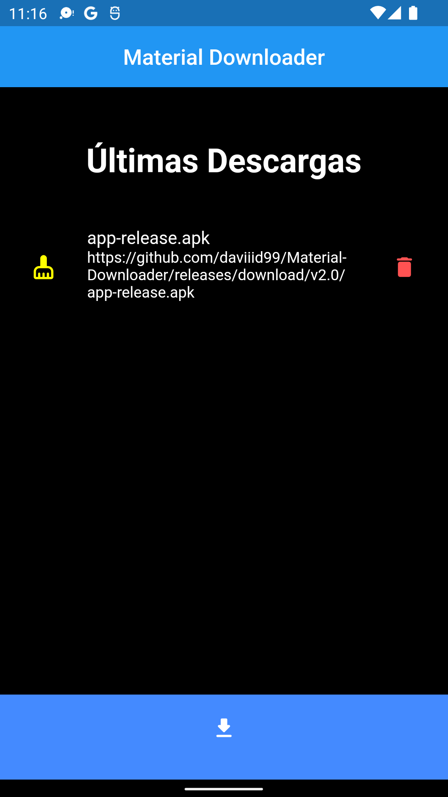

 


 # Material Downloader
 Multiplatform downloader made with Flutter(Dart)

# Platform Tested Compatibility

- [x] android
- [ ] web
- [ ] linux desktop
- [ ] windows desktop
- [ ] iOS
- [ ] fuchsiaOS

# Dependencies
All plugins used on this project
```
dependencies :
  url_launcher: ^6.1.6
  permission_handler: ^10.2.0
  dio: ^4.0.6
  path_provider: ^2.0.11
  open_file: ^3.2.1
  file_picker: ^4.6.1
  flutter_launcher_icons: "^0.9.0"

```

# Permissions
All permissions required for this application
```
    <uses-permission android:name="android.permission.READ_EXTERNAL_STORAGE" />
    <uses-permission android:name="android.permission.WRITE_EXTERNAL_STORAGE" />
    <uses-permission android:name="android.permission.INTERNET"/>
    <uses-permission android:name="android.permission.REQUEST_DELETE_PACKAGES"/>
    <uses-permission android:name="android.permission.REQUEST_INSTALL_PACKAGES"/>

```

 # Screens




